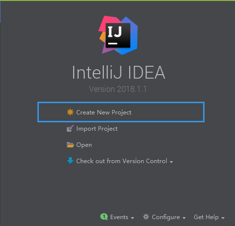
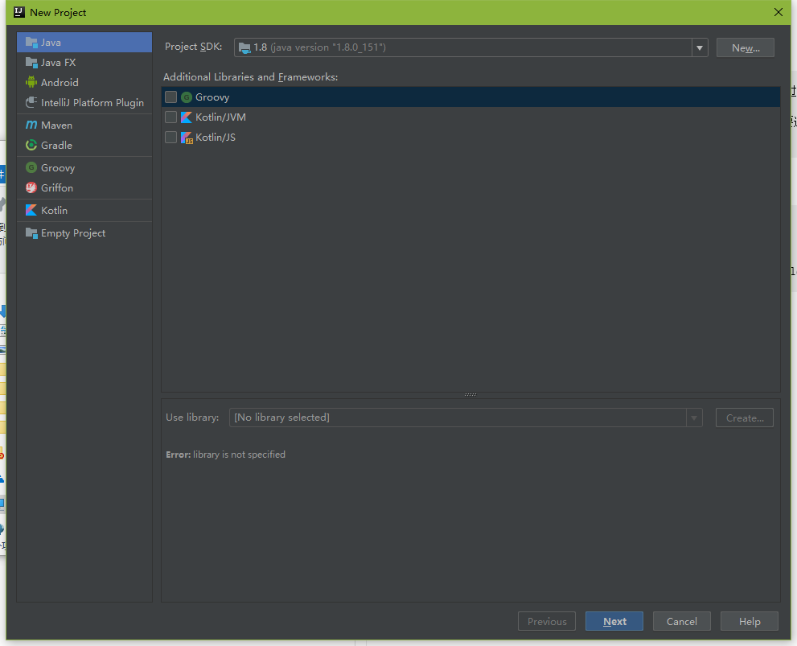
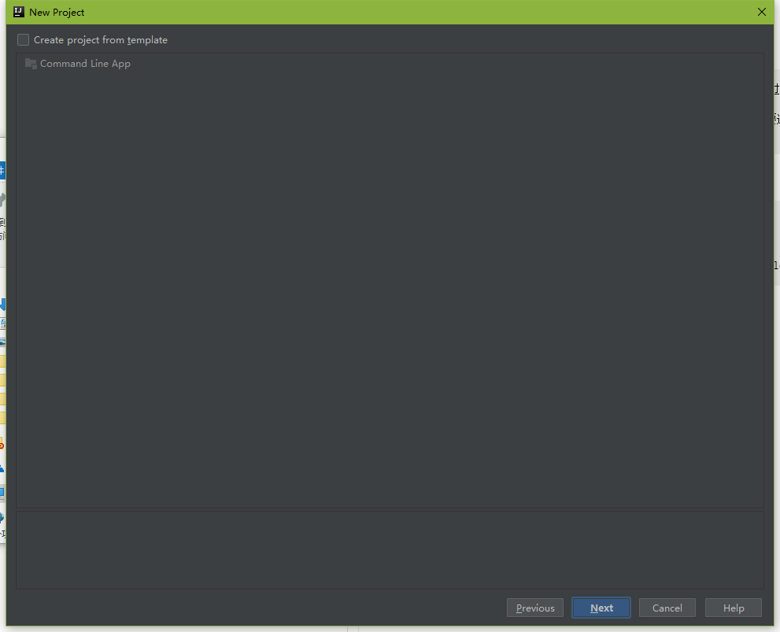
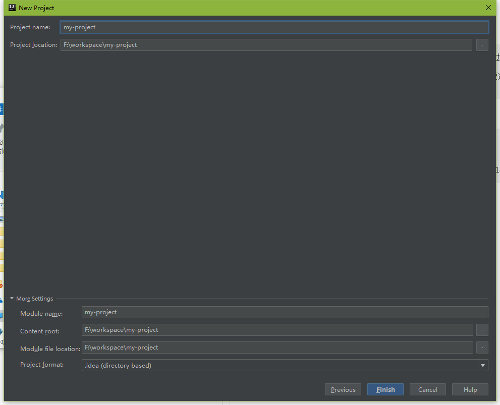
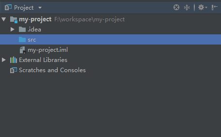
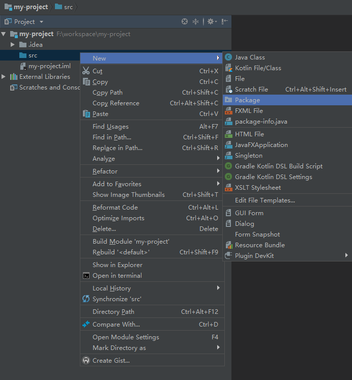

## 新建项目   create new project

### Step1

	

	图1.1 首页

> 说明：打开软件，选择Create New Project

### Step2

 

	

	图1.2 选择项目类型

> 说明：继步骤1，选择项目类型，此处选择Java，选择相应的JDK环境，其他的环境用不到，不选择。
### Step3

 

	

	图1.3 创建代码样板

>说明：此处提示创建代码模板，不选择

### Step4

 

	

	图1.4 给项目命名

>说明：给项目命名，可根据项目来自定义名称。此处命名为my-project

### Step5

 

	

	图1.5 项目结构

>说明：项目创建好后的项目结构，src目录是代码存放目录

### Step6

 

	

	图1.6 创建新的package

>说明：此处创建新的package，命名为basic_java，之后进行代码测试