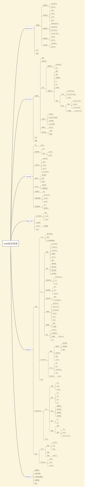

> When the night is darkest, dawn is nearest.
> 夜至黑，昼将来。

## 博客的演变

1. 开始想做偏前端的博客，具体可以参考旧版目录。
2. 随着知识的广度越来越大，考虑做一个揽括前后端所有知识点的博客。
3. 发现单就精通前端就需要不少精力，太广的知识容易分散精力，也不太容易增加自己的不可替代性。
4. 所以现在准备就自己熟悉的偏前端领域来挖掘一些更深层次的知识点，增加自己的知识深度。
5. 计划分为几个大类，针对每个大类中的比较疑难或者有价值的主体进行深入挖掘。
6. 当然不包括技术，团队管理和软件工程方法论也很重要，甚至比技术更加重要，一个人的力量是微小的，团队的力量是无穷的。
7. 总体来说，博客经历了`少-多-精`这个心路历程，也发现了技术和管理相结合才能最大化团队的发展和对业务的支持。
8. 技术服务于业务，脱离业务谈技术是不行的，用更好、更合理的技术解决了复杂的业务，使得业务稳定性、扩展性高，那就是核心竞争力，当然，如何利用团队资源产生更多的业务价值，也是一种本事。

## 传送门

- [前端知识点](/v3/frontend/index.html)

## web知识体系

<!-- ## 前端传送门

- [html](/frontend/html/define.html)
- [css](/frontend/css/1_define.html)
- [js](/frontend/js/note.html)
- [framework](/frontend/framework/vue.html)

## 后端传送门

- [node](/backend/node/express.html)
- [http](/backend/http/http.html)
- [java](/backend/java/java.html)
- [database](/backend/database/mysql.html)

## 软件工程化

- [概念&实践](/software/engineering.html)

## 算法

- [概念&实践](/arithmetic/lintcode.html) -->

## 请作者喝杯咖啡

### 微信

