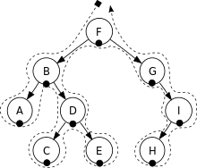
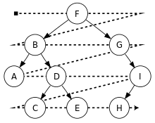

## 深度优先遍历

- 不管是什么遍历，以根为开始节点

### 先（前）序遍历

- 先访问根，然后访问子树的遍历方式

深度优先遍历 - 前序遍历：
F, B, A, D, C, E, G, I, H.

### 中序遍历

- 先访问左（右）子树，然后访问根，最后访问右（左）子树的遍历方式

深度优先遍历 - 中序遍历：
A, B, C, D, E, F, G, H, I.

### 后序遍历

- 先访问子树，然后访问根的遍历方式

深度优先搜索 - 后序遍历：
A, C, E, D, B, H, I, G, F.

## 广度优先遍历

- 先访问离根节点最近的节点，又称按层次遍历，算法借助队列实现

广度优先遍历 - 层次遍历：
F, B, G, A, D, I, C, E, H.