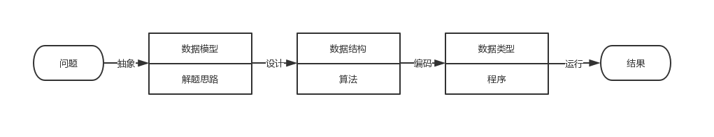
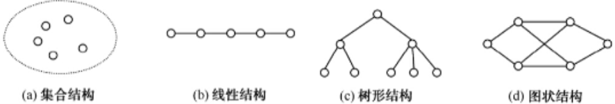

## 绪论

1. 数据作为计算机加工处理的对象，如何在计算机中表示和存储是计算机科学研究的主要内容之一，更是计算机技术需要解决的关键问题之一。
2. 数据是计算机化的信息，是计算机处理的主要对象。
3. 科学计算、数据处理、过程控制、文件存储、数据库技术等，都是对数据进行加工处理的过程。
4. 因此，要设计出一个结构好、效率高的程序，必须研究数据的的特性、数据间的相互关系及其对应的存储表示方法，并利用这些特性和关系设计对应的算法和程序。

### 从问题到程序

1. “数据结构”的主要研究内容是数据之间的逻辑关系和物理实现，即探索有利的数据组织形式及存取方式。
2. 想要更好的运用计算机来解决实际问题，仅仅依赖几种计算机程序设计语言是不够的，还必须学习和掌握数据结构的有关知识。
3. 使用计算机来解决一个具体问题时，一般需要经过下列几个步骤：

4. 由于当时所涉及的运算对象是简单的整型数据、实型数据或布尔型数据，所以程序设计者的主要精力集中在程序设计的技巧上，而无需重视数据结构。
5. 随着计算机应用领域的扩大和软/硬件的发展，非数值计算问题显得越来越重要。
6. 当今处理非数值计算性问题占用了90%以上的机器时间，这类问题涉及的处理对象不再是简单的数据类型，其形式更加多样，结构更为复杂，数据元素之间的相互关系一般无法直接用数学方程式加以描述。
7. 解决这类问题的关键不再是数学分析和计算方法，而是设计出合适的数据结构，以便有效地解决问题。

### 有关概念和术语

1. **数据**：信息的载体，能够被计算机识别、存储和处理。是计算机程序加工的原料，应用程序能处理数值数据（整数、实数、复数），非数值数据（字符、文字、图形、图像、语音）。
2. **数据元素**：数据的基本单位，在计算机程序中通常作为一个整体进行考虑和处理，一个数据元素由若干个数据项组成。
3. **数据项**：指不可分割的、具有独立意义的最小数据单位，有时也称为字段或域。
4. **数据结构**：互相之间存在着一种或多种关系的数据元素的集合。
	1. *集合结构*：数据元素之间的关系是“属于同一个集合”。
	2. *线性结构*：除了属于同一个集合外，还存在着一对一的顺序关系。
	3. *树形结构*：除了属于同一个集合外，还存在着一对多的顺序关系。
	4. *图状结构*：除了属于同一个集合外，还存在着多对多的任意关系，也称网状结构。
	
5. **一个数据结构有两个要素**：一是数据元素，二是数据元素之间的关系，通常可以采用一个二元组来表示：`Data_Structure = (D, R)`，D是数据元素集合，R是D中元素之间关系的集合。
6. **数据结构包括数据的逻辑结构和物理结构**：
	1. *逻辑结构*：从具体问题抽象出来的数学模型，与数据的存储无关。
	2. *物理结构*：数据的逻辑结构在计算机中的存储表示（映像），也称存储结构。数据的存储方法包括顺序存储和链式存储：
		1. *顺序存储*：通过数据元素在计算机中存储位置关系来表示元素间的逻辑关系，通常把逻辑上相邻的元素存储在物理位置相邻的存储单元中。是一种最基本的存储表示方法，通常借助程序设计语言中的数组来实现。
		2. *链式存储*：对逻辑上相邻的元素不要求其物理位置相邻，元素间的逻辑关系通过指针字段来表示，通常借助程序设计语言中的指针来实现。
		3. 其他：索引存储、散列表存储。
7. **数据类型**
	1. 在高级程序设计语言中用以限制变量取值范围和可能进行的操作的总和称为数据类型。
	2. 两类：
		1. 非结构的原子类型，不可再分解（如C语言中的：整型、实型、字符型、指针类型和空类型）。
		2. 结构类型：由多个结构类型组成，并可以分解，结构类型的成分可以是非结构的，也可以是结构的（例：数组中的元素）。

### 参考文献

> 数据结构(邓文华)