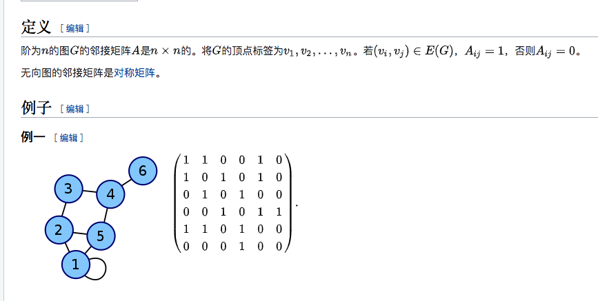

## 定义

1. 图用于表示物件与物件之间的关系，是图论的基本研究对象。
2. 一张图由一些小圆点和连结这些圆点的直线或曲线组成。

## 存储表示

1. 邻接矩阵：

> 1. 最大值是6，所以是6*6的矩阵。
> 2. 如果两个点之间有连接，那么标记为1，否则标记为0，如：6和4之间由连接，那么A64和A46为1。

## 遍历

1. 深度优先搜索法：是树的先根遍历的推广，基本思想是：从图G的某个顶点v0出发，访问v0，然后选择一个与v0相邻且没被访问过的顶点vi访问，再从vi出发选择一个与vi相邻且未被访问的顶点vj进行访问，依次继续。如果当前被访问过的顶点的所有邻接顶点都已被访问，则退回到已被访问的顶点序列中最后一个拥有未被访问的相邻顶点的顶点w，从w出发按同样的方法向前遍历，直到图中所有顶点都被访问。

2. 广度优先搜索法：是树的按层次遍历的推广，基本思想是：首先访问初始点vi，并将其标记为已访问过，接着访问vi的所有未被访问过的邻接点vi1,vi2,…, vi t，并均标记已访问过，然后再按照vi1,vi2,…, vi t的次序，访问每一个顶点的所有未被访问过的邻接点，并均标记为已访问过，依次类推，直到图中所有和初始点vi有路径相通的顶点都被访问过为止。