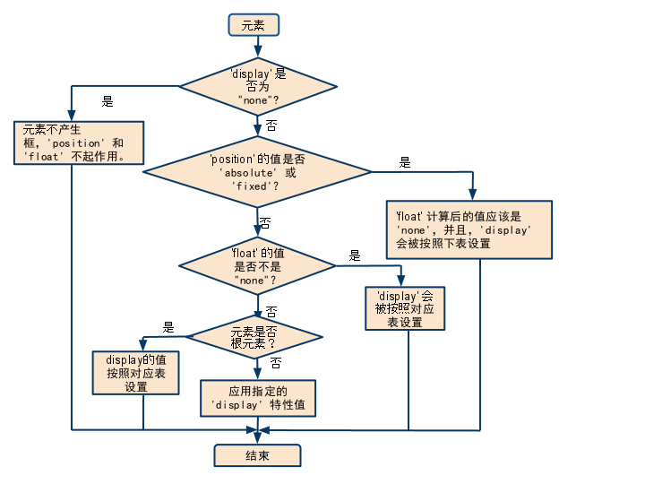

## 布局

### 盒(框)模型


### display
1. `block`: 块级元素
  1. 每个元素独占一行
  1. 宽度默认`100%`
  1. 框之间的垂直距离是由框的垂直外边距计算出来。

1. `inline`：行内元素
  1. 和其他元素都在一行
  1. 元素的`height`、`width`、`margin-top`、`margin-bottom`都不可设置
  1. 元素的宽度就是它包含的文字或图片的宽度，不可改变
  1. 多个内联元素的宽度超过行宽时，会自动换行
  1. 通常用于段落中某些文字的修饰
  1. 可以使用水平内边距、边框和外边距调整它们的间距。但是，垂直内边距、边框和外边距不影响行内框的高度。由一行形成的水平框称为行框（Line Box），行框的高度总是足以容纳它包含的所有行内框。不过，设置行高可以增加这个框的高度。

1. `inline-block`：行内块级元素
  1. 和其他元素都在一行上
  1. 元素的`height`、`width`、`line-height`、`margin-top`、`margin-bottom`都可设置
  1. 多个内联块状元素的宽度超过行宽时，会自动换行

1. `none`: 用于隐藏元素，不占据空间

### position
1. `static`：元素框正常生成。块级元素生成一个矩形框，作为文档流的一部分，行内元素则会创建一个或多个行框，置于其父元素中。
1. `relative`：元素框偏移某个距离。元素仍保持其未定位前的形状，它原本所占的空间仍保留。如果不添加额外的属性，表现的和`static`一样，如果添加了`top`、`right`、`bottom`、`left`会使其偏离正常位置，其它元素此时不会受该元素影响。相对定位实际上被看作普通流定位模型的一部分，因为元素的位置相对于它在普通流中的位置。意思就是设置四个方向的值就是相对于原来位置的偏移，其它元素在定位时还是以它原来所在的位置定位。
1. `absolute`：包含块由离它最近的`position`属性为`absolute`、`relative`或`fixed`祖先元素创建，如果没有这三种类型，则以当前可视窗口为包含块（即`<html>`)。设置为绝对定位的元素框从文档流完全删除，并相对于其包含块定位，包含块可能是文档中的另一个元素或者是初始包含块。元素原先在正常文档流中所占的空间会关闭，就好像该元素原来不存在一样。元素定位后生成一个块级框，而不论原来它在正常流中生成何种类型的框。
1. `fixed`：相对于可视窗口（`<html>`）定位。

### float

1. 通常用于用于实现文字环绕图片效果。
1. 浮动的框可以向左或向右移动，直到它的外边缘碰到包含框或另一个浮动框的边框为止。
1. 由于浮动框不在文档的普通流中，所以文档的普通流中的块框表现得就像浮动框不存在一样。

### 优先级

> [w3c](http://w3help.org/zh-cn/kb/009/)



设定值 | 计算值
--- | ---
inline-table | table
inline / run-in / inline-block | block
table-row-group / table-column / table-column-group / table-header-group / table-footer-group / table-row / table-cell / table-caption | block
其他 | 同设定值

1. display === none ：元素不被渲染，position、float不起作用。
2. postion === absolute || position === fixed ：元素为绝对定位，float不起作用。
3. float !== none：元素会脱离文档流。

## 响应式&自适应

### 响应式：媒体查询(@media)
>[参考](http://www.runoob.com/css/css-rwd-mediaqueries.html)

### 自适应：百分比
>[参考](http://www.ruanyifeng.com/blog/2012/05/responsive_web_design.html)

## 动画

>[MDN](https://developer.mozilla.org/zh-CN/docs/Web/CSS/CSS_Animations/Using_CSS_animations)
>[ruanyifeng](http://www.ruanyifeng.com/blog/2014/02/css_transition_and_animation.html)

## 选择器

### 层叠

**什么选择器在层叠中胜出取决于三个因素：按重量级顺序排列 - 前面的一种会否决后一种:**

### 重要性

- 在`css`中，有一个特别的语法可以让一条规则总是优先于其他规则：`!important`
  - 使用场景：`cms`不能编辑核心模块/重写`web`开发人员的样式
  - 一般情况下禁止使用，**会导致大型样式表难以维护**

### 专用性

1. big: `!important` 
2. 1000: `style`属性
3. 100: `ID`选择器
4. 10: 类选择器、属性选择器、伪类（`:`号，如`hover`, `active`, `visited`）
5. 1: 元素选择器、伪元素（`::`号，如`after`, `before`）

### 源代码次序

**如果多个相互竞争的选择器具有相同的重要性和专用性 - 后面的规则将战胜先前的规则**

## BFC

>[参考](https://zhuanlan.zhihu.com/p/25321647)

### 概念

1. 是页面中的一块渲染区域，并且有一套渲染规则，决定了其子元素将如何定位，以及和其他元素的关系和相互作用。
2. 即`Block Formatting Contexts`（块级格式化上下文），属于上述定位方案的普通流。
3. 具有`BFC`特性的元素可以看作是隔离了的独立容器，容器里面的元素不会再布局上影响到外面的元素，并且具有普通容器没有的一些特性。
4. 可以理解为`BFC`是一个封闭的大箱子，箱子内部的元素无论如何人翻江倒海，都不会影响到外部。

### 触发

**只要元素满足下面任一条件即可触发`BFC`特性:**
1. `body`根元素
2. 浮动元素：float && float !== none
3. 绝对定位元素：position === absolute || position === fixed
4. display === inline-block || display === table-cells || display === flex
5. overflow && overflow !== visible

### 特性

1. 同一个`BFC`下外边距会发生折叠
2. 如果想避免外边距的重叠，可以将其放在不同的`BFC`容器中
3. 浮动的元素会脱离文档流，如果触发容器的`BFC`，那么容器将会包裹着浮动元素
4. BFC可以阻止元素被浮动元素覆盖，但是文本信息不会被浮动元素覆盖

### 导致的问题

#### 外边距塌陷

> [MDN](https://developer.mozilla.org/zh-CN/docs/Web/CSS/CSS_Box_Model/Mastering_margin_collapsing)

> [解决方式](https://segmentfault.com/a/1190000011075163)

**块的顶部外边距和底部外边距有时被组合（折叠）为单个边框，其大小是组合到其中的最大外边距，这种行为称为外边距塌陷（合并）**

#### 发生条件

1. 相邻元素之间：毗邻的两个元素之间的外边距会折叠

2. 父元素与其第一个/最后一个子元素：如果没有触发BFC，那么子元素的外边距会溢出到父元素的外面

3. 空的块级元素：不包含任何内容，该元素的上下外边距会折叠

#### 解决方案

1. 设置padding或者border，这个针对第二种情况

1. 设置同一个方向的margin，这个针对所有情况

1. 创建BFC(块格式化上下文)，这个针对第二种情况

    - 根元素或包含根元素的元素

    - 浮动元素: float != none

    - 绝对定位元素: position = absolute | fixed

    - 行内块元素: display = inline-block

    - 弹性元素: display = flex | inline-flex

    - overflow != visible

    - 网格元素: display = grid | inline-grid 元素的直接子元素

    - 多列容器: conlumn-count | column-width != auto | column-count = 1

    - column-span = all

    - display = flow-root

    - contain = layout | content | strict

    - 表格单元格: display = table-cell

    - 表格标题: display = table-caption

    - 匿名表格单元格元素: display = table | table-row | table-row-group | table-header-group | table-footer-group | inline-table

#### float高度塌陷

```css
.after-box{
/* 和float方向保持一致 */
clear: left;
/* clear: both 清除所有方向的浮动 */
}
/* 或者 */
.after-box{
overflow: hidden;
}
```

## 回流和重绘

>[参考资料](https://juejin.im/post/5a9923e9518825558251c96a)
>[参考资料](https://www.html.cn/archives/4996)
>[参考资料](https://segmentfault.com/a/1190000017332455)

1. 回流一定会引起重绘，重绘不一定引起回流
2. 可以通过减少页面的回流和重绘来优化性能
3. 可以使用`requestAnimationFrame`来限制`dom`元素渲染的帧率以防止页面卡顿

### 回流

**当`Render Tree`中部分或全部元素的尺寸、结构或某些属性发生变化时，浏览器重新渲染部分或全部文档的过程。**

1. 页面首次渲染
2. 浏览器窗口大小发生变化
3. 元素尺寸或位置发生变化
4. 元素内容变化（文字数量或图片大小等）
5. 元素字体大小变化
6. 添加或删除可见的DOM元素
7. 激活CSS伪类
8. 查询某些属性或调用某些方法
   1. clientWidth、clientHeight、clientTop、clientLeft
   1. offsetWidth、offsetHeight、offsetTop、offsetLeft
   1. scrollWidth、scrollHeight、scrollTop、scrollLeft
   1. scrollIntoView()、scrollIntoViewIfNeeded()
   1. getComputedStyle()
   1. getBoundingClientRect()
   1. scrollTo()

### 导致重绘的操作

**当页面中的元素样式的改变并不影响它在文档流中的位置时（如：color、background-color、visibility），浏览器就会将新样式赋予给元素并重新绘制它的过程。**

### 性能影响

1. 回流比重绘的代价要更高。
1. 有时即使仅仅回流一个单一的元素，它的父元素以及任何跟随它的元素也会产生回流。
1. 现代浏览器会对频繁的回流或重绘操作进行优化：
  - 浏览器会维护一个队列，把所有引起回流和重绘的操作放入队列中，如果队列中的任务数量或者时间间隔达到一个阈值的，浏览器就会将队列清空，进行一次批处理，这样可以把多次回流和重绘变成一次。
  - 当你访问以下属性或方法时，浏览器会立刻清空队列：
    - clientWidth、clientHeight、clientTop、clientLeft
    - offsetWidth、offsetHeight、offsetTop、offsetLeft
    - scrollWidth、scrollHeight、scrollTop、scrollLeft
    - width、height
    - getComputedStyle()
    - getBoundingClientRect()
1. 因为队列中可能会有影响到这些属性或方法返回值的操作，即使你希望获取的信息与队列中操作引发的改变无关，浏览器也会强行清空队列，确保你拿到的值是最精确的。

### 如何避免

#### CSS
1. 避免使用table布局。
1. 尽可能在DOM树的最末端改变class。
1. 避免设置多层内联样式。
1. 将动画效果应用到position属性为absolute或fixed的元素上。
1. 避免使用CSS表达式（例如：calc()）。

#### JavaScript

1. 避免频繁操作样式，最好一次性重写style属性，或者将样式列表定义为class并一次性更改class属性。
1. 避免频繁操作DOM，创建一个documentFragment，在它上面应用所有DOM操作，最后再把它添加到文档中。
1. 也可以先为元素设置display: none，操作结束后再把它显示出来。因为在display属性为none的元素上进行的DOM操作不会引发回流和重绘。
1. 避免频繁读取会引发回流/重绘的属性，如果确实需要多次使用，就用一个变量缓存起来。
1. 对具有复杂动画的元素使用绝对定位，使它脱离文档流，否则会引起父元素及后续元素频繁回流。

## 移动端1px像素显示模糊

> [参考资料](https://segmentfault.com/a/1190000007604842)

### transform: scale(0.5)

```css
div{
    height:1px;
    background:#000;
    -webkit-transform: scaleY(0.5);
    -webkit-transform-origin:0 0;
    overflow: hidden;
}
/* 或者 */
div::after{
    content:'';width:100%;
    border-bottom:1px solid #000;
    transform: scaleY(0.5);
}
/* 或者 */
div::after {
    content: '';
    width: 200%;
    height: 200%;
    position: absolute;
    top: 0;
    left: 0;
    border: 1px solid #bfbfbf;
    border-radius: 4px;
    -webkit-transform: scale(0.5,0.5);
    transform: scale(0.5,0.5);
    -webkit-transform-origin: top left;
}
```

### box-shadow
- 圆角没有问题，但颜色不好控制
```css
div {
  -webkit-box-shadow:0 1px 1px -1px rgba(0, 0, 0, 0.5);
}
```

### viewport+rem

```html
<html>  
  <head>  
      <title>1px question</title>  
      <meta http-equiv="Content-Type" content="text/html;charset=UTF-8">  
      <meta name="viewport" id="WebViewport" content="initial-scale=1, maximum-scale=1, minimum-scale=1, user-scalable=no">       
      <style>  
          html {  
              font-size: 1px;  
          }             
          * {  
              padding: 0;  
              margin: 0;  
          }  
            
          .bds_b {  
              border-bottom: 1px solid #ccc;  
          }  
            
          .a,  
          .b {  
              margin-top: 1rem;  
              padding: 1rem;                
              font-size: 1.4rem;  
          }  
            
          .a {  
              width: 30rem;  
          }  
            
          .b {  
              background: #f5f5f5;  
              width: 20rem;  
          }  
      </style>  
      <script>  
        
          var viewport = document.querySelector("meta[name=viewport]");  
          //下面是根据设备像素设置viewport  
          if (window.devicePixelRatio == 1) {  
              viewport.setAttribute('content', 'width=device-width,initial-scale=1, maximum-scale=1, minimum-scale=1, user-scalable=no');  
          }  
          if (window.devicePixelRatio == 2) {  
              viewport.setAttribute('content', 'width=device-width,initial-scale=0.5, maximum-scale=0.5, minimum-scale=0.5, user-scalable=no');  
          }  
          if (window.devicePixelRatio == 3) {  
              viewport.setAttribute('content', 'width=device-width,initial-scale=0.3333333333333333, maximum-scale=0.3333333333333333, minimum-scale=0.3333333333333333, user-scalable=no');  
          }  
          var docEl = document.documentElement;  
          var fontsize = 10 * (docEl.clientWidth / 320) + 'px';  
          docEl.style.fontSize = fontsize;  
            
      </script>  
  </head>  
  <body>  
      <div class="bds_b a">下面的底边宽度是虚拟1像素的</div>  
      <div class="b">上面的边框宽度是虚拟1像素的</div>  
  </body>  
</html> 
```

### boder-image
- 需要制作图片，圆角的时候会出现模糊。
```css
.border-image-1px {
    border-width: 1px 0px;
    -webkit-border-image: url("xxx") 2 0 stretch;
}
```

### background-image
- 渐变实现，不能实现圆角
```css
.border {
  background-image:linear-gradient(180deg, red, red 50%, transparent 50%),
  linear-gradient(270deg, red, red 50%, transparent 50%),
  linear-gradient(0deg, red, red 50%, transparent 50%),
  linear-gradient(90deg, red, red 50%, transparent 50%);
  background-size: 100% 1px,1px 100% ,100% 1px, 1px 100%;
  background-repeat: no-repeat;
  background-position: top, right top,  bottom, left top;
  padding: 10px;
}
```
  
## 消除1px宽度问题/宽度适配

**`box-sizing`属性可以被用来调整这些表现：**

- `content-box`：默认值。如果你设置一个元素的宽为`100px`，那么这个元素的内容区会有`100px`宽，并且任何边框和内边距的宽度都会被累加到最后绘制出来的元素宽度中，造成预期结果的偏差。

- `border-box`：告诉浏览器去理解你设置的边框和内边距的值是包含在`width`内的。也就是说，如果你将一个元素的`width`设为`100px`,那么这`100px`会包含其它的`border`和`padding`，内容区的实际宽度会是`width`减去`border` + `padding`的计算值。大多数情况下这使得我们更容易的去设定一个元素的宽高。

## CSS3新特性

>[参考资料](https://developer.mozilla.org/zh-CN/docs/Web/CSS/CSS3)

- 圆角
- 阴影
- `gradients`(渐变)
- `transitions`(过渡)
- `animations`(动画)
- 新的布局方式，如 `multi-columns`、 `flexible box` 与 `grid layouts`

## 学习flex布局

> [知乎专栏](https://zhuanlan.zhihu.com/p/25303493)


### flex容器

- 首先需要指定一个容器

  - 通过`display: flex; /* or inline-flex */`分别生成一个块状或行内的 `flex` 容器盒子。

  - 如果你使用块元素如 `div`，你就可以使用 `flex`，而如果你使用行内元素，你可以使用 `inline-flex`。

> 当设置 flex 布局之后，子元素的 float、clear、vertical-align 的属性将会失效。

- 有六种属性可以设置在容器上

  - flex-direction

    - 默认值：row，主轴为水平方向，起点在左端

    - row-reverse：主轴为水平方向，起点在右端

    - column：主轴为垂直方向，起点在上沿

    - column-reverse：主轴为垂直方向，起点在下沿
    
  - flex-wrap: 决定容器内项目是否可换行

    - 默认情况下，项目都排在主轴线上，使用 flex-wrap 可实现项目的换行。

    - 默认值：nowrap 不换行，即当主轴尺寸固定时，当空间不足时，项目尺寸会随之调整而并不会挤到下一行。

    - wrap：项目主轴总尺寸超出容器时换行，第一行在上方

    - wrap-reverse：换行，第一行在下方

  - flex-flow: flex-direction 和 flex-wrap 的简写形式

    - 默认值为: row nowrap

  - justify-content：定义了项目在主轴的对齐方式

    - flex-start：左对齐，默认值

    - flex-end：右对齐

    - center：居中

    - space-between：两端对齐，项目之间的间隔相等，即剩余空间等分成间隙

    - space-around：每个项目两侧的间隔相等，所以项目之间的间隔比项目与边缘的间隔大一倍

  - align-items：定义了项目在交叉轴上的对齐方式

    - stretch：默认值

    - flex-start：交叉轴的起点对齐

    - flex-end：交叉轴的终点对齐

    - center：交叉轴的中点对齐

    - baseline: 项目的第一行文字的基线对齐

  - align-content：定义了多根轴线的对齐方式，如果项目只有一根轴线，那么该属性将不起作用

    - stretch：三条轴线平分容器的垂直方向上的空间，默认值

    - flex-start：轴线全部在交叉轴上的起点对齐

    - flex-end：轴线全部在交叉轴上的终点对齐

    - center：轴线全部在交叉轴上的中间对齐

    - space-between：轴线两端对齐，之间的间隔相等，即剩余空间等分成间隙。

    - space-around：每个轴线两侧的间隔相等，所以轴线之间的间隔比轴线与边缘的间隔大一倍。

### 有六种属性可运用在 item 项目上

- order: 定义项目在容器中的排列顺序，数值越小，排列越靠前，默认值为 0

- flex-basis: 定义了在分配多余空间之前，项目占据的主轴空间，浏览器根据这个属性，计算主轴是否有多余空间

    - 默认值：auto，即项目本来的大小, 这时候 item 的宽高取决于 width 或 height 的值。

    - 当主轴为水平方向的时候，当设置了 flex-basis，项目的宽度设置值会失效，flex-basis 需要跟flex-grow 和 flex-shrink 配合使用才能发挥效果。

    - 当 flex-basis 值为 0 % 时，是把该项目视为零尺寸的，故即使声明该尺寸为 140px，也并没有什么用。

    - 当 flex-basis 值为 auto 时，则跟根据尺寸的设定值(假如为 100px)，则这 100px 不会纳入剩余空间。

- flex-grow: 定义项目的放大比例

    - 默认值为 0，即如果存在剩余空间，也不放大

    - 当所有的项目都以 flex-basis 的值进行排列后，仍有剩余空间，那么这时候 flex-grow 就会发挥作用了。

    - 如果所有项目的 flex-grow 属性都为 1，则它们将等分剩余空间。(如果有的话)  

    - 如果一个项目的 flex-grow 属性为 2，其他项目都为 1，则前者占据的剩余空间将比其他项多一倍。

    - 当然如果当所有项目以 flex-basis 的值排列完后发现空间不够了，且 flex-wrap：nowrap 时，此时flex-grow 则不起作用了，这时候就需要接下来的这个属性。

- flex-shrink: 定义了项目的缩小比例

    - 默认值: 1，即如果空间不足，该项目将缩小，负值对该属性无效。

    - 这里可以看出，虽然每个项目都设置了宽度为 50px，但是由于自身容器宽度只有 200px，这时候每个项目会被同比例进行缩小，因为默认值为 1。

    - 如果所有项目的 flex-shrink 属性都为 1，当空间不足时，都将等比例缩小。

    - 如果一个项目的 flex-shrink 属性为 0，其他项目都为 1，则空间不足时，前者不缩小。

- flex: flex-grow, flex-shrink 和 flex-basis的简写

- align-self: 允许单个项目有与其他项目不一样的对齐方式

### 总结

#### 容器属性：

- flex-direction：控制嵌套元素排列方向，起点是左端还是右端，水平排列还是垂直排列

- flex-wrap：控制嵌套元素是否换行以及换行后第一行在上方还是下方

- justify-content：控制嵌套元素的对齐状况，左对齐还是右对齐，居中还是两端对齐，还是元素之间间隔相等

- align-items：定义了元素在交叉轴上的对齐方式，包括起点、终点、中点以及第一行文字基线

- align-content：定义了多根轴线的对齐方式，如果项目只有一根轴线，那么该属性将不起作用，也就是项目如何分隔垂直方向的空间

#### 项目属性：

- order：定义了项目的排列顺序，数值越小，排名越靠前，最小值为0

- flex-basis：定义了在分配多余空间之前，项目占据的主轴空间，浏览器根据这个属性，计算主轴是否有多余空间

- flex-grow：定义项目的放大比例

- flex-shrink：定义了项目的缩小比例

- align-self： 允许单个项目有与其他项目不一样的对齐方式，跟`align-items`类似，一个针对容器下的所有项目，一个针对单个项目

## 元素对齐

- 针对同一行`inline-block`元素

- 使用`<!-- -->`来消除元素之间的空隙

- 使用`vertical-align: middle;`来对齐各元素

```html
<html lang="en">
<head>
  <meta charset="UTF-8">
  <meta name="viewport" content="width=device-width, initial-scale=1.0">
  <meta http-equiv="X-UA-Compatible" content="ie=edge">
  <title>Document</title>
  <style>
    html, body {
      padding: 0;
      margin: 0;
      height: 100%;
      width: 100%;
    }
    #parent {
      height: 100%;
      width: 100%;
    }
    #div {
      display: inline-block;
      vertical-align: middle;
      height: 100px;
      width: 100px;
      background: red;
    }
    #input, #button {
      vertical-align: middle;
      height: 100px;
      width: 100px;
    }
  </style>
</head>
<body>
  <div id="parent">
    test<!-- 插入的文字会在 -->
    <div id="div"></div><!--  
  --><input id="input" type="text"><!-- 
  --><button id="button"></button>
  </div>
</body>
</html>
```

## 水平居中

```css
#main1{
  width: 100px;
  margin: 0 auto;
}
/* 或者 */
#main2{
  width: 100px;
  margin-left: auto;
  margin-right: auto;
}
```

## 垂直水平居中

> [参考资料](https://github.com/hawx1993/tech-blog/issues/12)

<p class="tip">注意`html`和`body`的初始化以及父元素的高度需要设置为`100%`<p>

### flex

```html
<!-- 有兼容性问题 -->
<html lang="en">
<head>
  <meta charset="UTF-8">
  <meta name="viewport" content="width=device-width, initial-scale=1.0">
  <meta http-equiv="X-UA-Compatible" content="ie=edge">
  <title>Document</title>
  <style>
    html, body {
      padding: 0;
      margin: 0;
      height: 100%;
      width: 100%;
    }
    #parent {
      height: 100%;
      display: flex;
      justify-content: center; /* 水平居中 */
      align-items: center; /* 垂直居中 */
    }
    #child {
      width: 100px;
      height: 100px;
      background: red;
    }
  </style>
</head>
<body>
  <div id="parent">
    <div id="child"></div>
  </div>
</body>
</html>
```

### transform

```html
<html lang="en">
<head>
  <meta charset="UTF-8">
  <meta name="viewport" content="width=device-width, initial-scale=1.0">
  <meta http-equiv="X-UA-Compatible" content="ie=edge">
  <title>Document</title>
  <style>
    html, body {
      padding: 0;
      margin: 0;
      height: 100%;
      width: 100%;
    }
    #parent {
      position: relative;
      height: 100%;
    }
    #child {
      position: absolute;
      left: 50%;
      top: 50%;
      transform: translate(-50%, -50%);
      height: 100px;
      width: 100px;
      background: red;
    }
  </style>
</head>
<body>
  <div id="parent">
    <div id="child"></div>
  </div>
</body>
</html>
```

### absolute

```html
<html lang="en">
<head>
  <meta charset="UTF-8">
  <meta name="viewport" content="width=device-width, initial-scale=1.0">
  <meta http-equiv="X-UA-Compatible" content="ie=edge">
  <title>Document</title>
  <style>
    html, body {
      padding: 0;
      margin: 0;
      height: 100%;
      width: 100%;
    }
    #parent {
      position: relative;
      height: 100%;
    }
    #child {
      position: absolute;
      left: 0;
      right: 0;
      top: 0;
      bottom: 0;
      margin: auto;
      height: 100px;
      width: 100px;
      background: red;
    }
  </style>
</head>
<body>
  <div id="parent">
    <div id="child"></div>
  </div>
</body>
</html>
```

### margin

> 需要知道子元素的具体宽高

```html
<html lang="en">
<head>
  <meta charset="UTF-8">
  <meta name="viewport" content="width=device-width, initial-scale=1.0">
  <meta http-equiv="X-UA-Compatible" content="ie=edge">
  <title>Document</title>
  <style>
    html, body {
      padding: 0;
      margin: 0;
      height: 100%;
      width: 100%;
    }
    #parent {
      position: relative;
      height: 100%;
    }
    #child {
      position: absolute;
      left: 50%;
      top: 50%;
      height: 100px;
      width: 100px;
      margin-left: -50px;
      margin-top: -50px;
      background: red;
    }
  </style>
</head>
<body>
  <div id="parent">
    <div id="child"></div>
  </div>
</body>
</html>
```

## 导航栏布局

```html
<!DOCTYPE html>
<html lang="en">
<head>
	<meta charset="UTF-8">
	<meta name="viewport" content="width=device-width, initial-scale=1.0">
	<meta http-equiv="X-UA-Compatible" content="ie=edge">
	<title>display</title>
	<style>
		html, body {
			width: 100%;
			height: 100%;
			margin: 0;
			padding: 0;
		}
		.left {
			position: absolute;
			left: 0;
			top: 0;
			width: 100px;
			height: 100%;
			background: blue;
		}
		.right {
			margin-left: 100px;
			height: 100%;
			width: auto;
			background: yellow;
		}
	</style>
</head>
<body>
	<div class="left">i am left</div>
	<div class="right">i am right</div>
</body>
</html>
```

## 背景

**在元素内容、内边距和边界下层的区域**

### 属性：

- `background-color`: 为背景设置一个纯色。

- `background-image`: 指定在元素的背景中出现的背景图像，这可以是静态文件，也可以是生成的渐变。

- `background-position`:指定背景应该出现在元素背景中的位置。

- `background-repeat`: 指定背景是否应该被重复(平铺)。

- `background-attachment`: 当内容滚动时，指定元素背景的行为，可以设置`fixed`来使得图片不跟随滚动条滚动.

- `background`: 在一行中指定以上五个属性的缩写。

- `background-size`: 允许动态调整背景图像的大小。

### color

- 大多数元素的默认颜色不是白色，而是`transparent`

### image

- `url()` 函数——它以一个参数的路径作为参数——获取一个静态图像文件来插入

### repeat

- `no-repeat`: 图像将不会重复，它只会显示一次。

- `repeat-x`: 图像将在整个背景中水平地重复。

- `repeat-y`: 图像会在背景下垂直地重复。

### position

- 允许我们在背景中任意位置放置背景图像。通常，该属性将使用两个通过空格分隔的值，该空间指定了图像的水平(x)和垂直(y)坐标。图像的左上角是原点(0,0)。把背景想象成一个图形，x坐标从左到右，y坐标从上到下。

- 不同的值类型：

  - 像`px`这样的绝对值，比如：`background-position: 200px 25px`

  - 像`rems`这样的相对值，比如：`background-position: 20rem 2.5rem`

  - 百分比，比如 `background-position: 90% 25%`

  - 关键字，比如 `background-position: right center`. 这两个值是直观的，可以分别取值比如 `left`，`center`， `right`和 `top`，`center`， `bottom`

### 渐变

- 渐变就是在背景中平滑的颜色过渡。

- 动态生成的渐变是在不久之前引入的，这是因为在web设计中使用渐变是非常受欢迎的，但是使用背景图像来实现渐变是相当不灵活的。

- 目前有两种类型的渐变——线性渐变(从一条直线到另一条直线)和径向渐变(从一个点发散出来)。

### 背景附着

- 使用`background-attachment`属性来控制的，该属性可以使用以下值：

  - `scroll`: 这将把背景修改为页面视图，因此它将在页面滚动时滚动。注意，我们说的是视图，而不是元素——如果你滚动实际的背景设置的元素，而不是页面，背景不会滚动。

  - `fixed`: 这可以在页面的位置上固定背景，所以当页面滚动时，它不会滚动，不管你是滚动页面还是背景设置的元素，它都会保持在相同的位置。

  - `local`:这个值后来被添加了(它只在`Internet Explorer 9+`中得到支持，而其他的则在`IE4+`中得到支持)，因为`scroll`值相当混乱，并且在许多情况下并没有真正做您想要的事情。`local` 值将背景设置为它所设置的元素的背景，因此当您滚动元素时，背景会随之滚动。

## 知识点

### 超出部分字体省略号
- 也可以使用js处理一下文字长度，多余的省略号，hover上去显示所有文字
```css
.ignore{
    white-space: nowrap;
    text-overflow: ellipsis;
    overflow: hidden;
}
```

### ios下流畅的滑动
```css
.scroll{
    overflow: scroll;
    -webkit-overflow-scrolling: touch;
    overflow: scroll;
    -webkit-overflow-scrolling: touch;
}
```

### 脱离文档流
1. 使用float后
  - 一个元素脱离文档流之后，其他的元素在定位的时候会当做没看见它，两者位置重叠都是可以的
  - 脱离文档流的元素（例如被float了）依然会出现在dom树里
  - 其它盒子看不见被float的元素，但是其他盒子里的文本看得见，可以做文字环绕效果

1. 使用absolute后
  - 其它盒子内的文本都会无视它

1. 脱离文档流的元素默认层级比普通文档流的元素高，absolute元素比float元素高

### 用纯CSS创建一个三角形
```css
div {
  width: 0;
  height: 0;
  border-width: 20px;
  border-style: solid;
  border-color: transparent transparent red transparent;
}
```

##3 满屏品字布局
- 上面的div宽100%
- 下面的两个div分别宽50%，用float或者inline使其不换行即可

### 初始化CSS

- 因为浏览器的兼容问题，不同浏览器对有些标签的默认值是不同的，如果没对CSS初始化往往会出现浏览器之间的页面显示差异。
- 当然，初始化样式会对`SEO`有一定的影响，但鱼和熊掌不可兼得，但力求影响最小的情况下初始化。
- 最简单的初始化方法（强烈不建议）： 
```css
* {padding: 0; margin: 0;} 
```
- 淘宝的样式初始化代码：
```css
body, h1, h2, h3, h4, h5, h6, hr, p, blockquote, dl, dt, dd, ul, ol, li, pre, form, fieldset, legend, button, input, textarea, th, td { margin:0; padding:0; }
body, button, input, select, textarea { font:12px/1.5tahoma, arial, \5b8b\4f53; }
h1, h2, h3, h4, h5, h6{ font-size:100%; }
address, cite, dfn, em, var { font-style:normal; }
code, kbd, pre, samp { font-family:couriernew, courier, monospace; }
small{ font-size:12px; }
ul, ol { list-style:none; }
a { text-decoration:none; }
a:hover { text-decoration:underline; }
sup { vertical-align:text-top; }
sub{ vertical-align:text-bottom; }
legend { color:#000; }
fieldset, img { border:0; }
button, input, select, textarea { font-size:100%; }
table { border-collapse:collapse; border-spacing:0; }
```

### zoom:1的清除浮动原理

- 清除浮动，触发`hasLayout`；`zoom`属性是IE浏览器的专有属性，它可以设置或检索对象的缩放比例。解决`ie`下比较奇葩的`bug`。譬如外边距（`margin`）的重叠，浮动清除，触发`ie`的`haslayout`属性等。
- 当设置了`zoom`的值之后，所设置的元素就会扩大或者缩小，高度宽度就会重新计算了，这里一旦改变`zoom`值时其实也会发生重新渲染，运用这个原理，也就解决了`ie`下子元素浮动时候父元素不随着自动扩大的问题。
- `zoom`属是`ie`浏览器的专有属性，火狐和老版本的`webkit`核心的浏览器都不支持这个属性。然而，`zoom`现在已经被逐步标准化，出现在 `CSS 3.0` 规范草案中。
- 目前非`ie`由于不支持这个属性，它们又是通过什么属性来实现元素的缩放呢？可以通过`css3`里面的动画属性`scale`进行缩放。

### chrome记住密码后自动填充表单的黄色背景修改为白色背景
```css
input:-webkit-autofill, textarea:-webkit-autofill, select:-webkit-autofill {
  background-color: rgb(250, 255, 189); /* #FAFFBD; */
  background-image: none;
  color: rgb(0, 0, 0);
}
```

### position:fixed;在IOS下无效
- fixed的元素是相对整个页面固定位置的，你在屏幕上滑动只是在移动这个所谓的viewport，原来的网页还好好的在那，fixed的内容也没有变过位置，所以说并不是iOS不支持fixed，只是fixed的元素不是相对手机屏幕固定的。
```html
<meta name="viewport" content="width=device-width, initial-scale=1.0, maximum-scale=1.0, minimum-scale=1.0, user-scalable=no"/>
```

### 手动写动画的最小时间间隔

**多数显示器默认频率是60Hz，即1秒刷新60次，所以理论上最小间隔为1/60 ＊ 1000 ms ＝ 16.7ms**

### overflow: scroll时不能平滑滚动
```css
.fix {
  -webkit-overflow-scrolling: touch;
}
```

### 有一个高度自适应的div，里面有两个div，一个高度100px，希望另一个填满剩下的高度。
**下面的这个方案不够完美，padding还是属于这个盒子，只不过一般而言padding里面不放置内容，所以也还可以。**
**使用overflow: hidden;或者不使用box-sizing: border-box;会导致浏览器还可以向下滑动一段距离。**
```html
<!DOCTYPE html>
<html lang="en">
<head>
	<meta charset="UTF-8">
	<meta name="viewport" content="width=device-width, initial-scale=1.0">
	<meta http-equiv="X-UA-Compatible" content="ie=edge">
	<title>display-top-bottom</title>
	<style>
		html, body {
			width: 100%;
			height: 100%;
			padding: 0;
			margin: 0;
			/* overflow: hidden; */
		}
		.top {
			position: absolute;
			top: 0;
			left: 0;
			height: 100px;
			width: 100%;
			background: red;
		}
		.bottom {
			box-sizing: border-box;
			padding-top: 100px;
			margin-top: 100px;
			height: 100%;
			background: yellow;
		}
	</style>
</head>
<body>
	<div class="top"></div>
	<div class="bottom"></div>
</body>
</html>
```

### rem布局

> [布局](https://segmentfault.com/a/1190000010211016)

> [优缺点](https://www.cnblogs.com/qieguo/p/5386565.html)